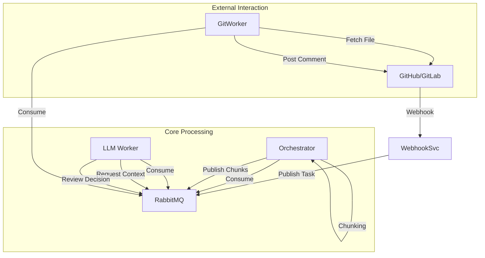

# Building an Autonomous AI Code Reviewer: An Engineering Deep Dive

## Introduction: Beyond Simple "Chat with Code"

In the modern software development lifecycle, the Pull Request (PR) is the critical bottleneck. while CI/CD pipelines automate testing and deployment, code review remains a strictly manual, high-latency process. 

Most "AI Reviewers" on the market today are simple wrappers around `git diff | llm`. They suffer from two fatal flaws:
1.  **Context Blindness**: They only see the 10 changed lines, not the function definitions those lines rely on.
2.  **Noise**: They comment on whitespace, formatting, or trivial renames, wasting developer time.

This post details the architecture of **AI-Powered Pull Request Reviewer**, an autonomous agentic system designed to solve these problems. We built a distributed, event-driven microservices architecture that uses **Abstract Syntax Trees (AST)** for noise reduction and **Recursive Agentic Loops** for deep context understanding.

---

## 1. High-Level Architecture: Asynchronous Event-Driven Design

We chose a microservices architecture to decouple the *ingestion* of events from the *intelligence* processing them. This allows us to scale the expensive ML workloads independently of the lightweight webhook handler.

### The Service Mesh

The system consists of four distinct services, communicating via **RabbitMQ** (AMQP) for task distribution and **Redis** for shared state.

1.  **Webhook Service**: The Edge Layer.
2.  **Orchestrator Service**: The Map-Reduce Manager.
3.  **LLM Worker**: The Reasoning Engine.
4.  **Git Worker**: The Side-Effect Handler.

---

## 2. Deep Dive into Key Components

### A. The Webhook Security Layer (Webhook Service)
Exposing an endpoint to the public internet requires rigorous security.
*   **Signature Verification**: We implement HMAC-SHA256 verification for GitHub (`X-Hub-Signature-256`) and Token validation for GitLab. This happens *before* any JSON parsing to mitigate DoS attacks.
*   **Idempotency & Delivery Tracking**: We capture the `X-GitHub-Delivery` UUID. If GitHub retries a webhook (which they do often on timeouts), we check Redis to see if we've already processed this ID. If so, we return `200 OK` immediately without re-queueing.

### B. The Noise Assassin: AST Semantic Filtering (Orchestrator)
The biggest complaint about AI reviewers is "Why are you commenting on a variable rename?" or "This is just a formatting change."

Regex-based filtering is insufficient for code. We integrated **Tree-sitter**, a high-performance incremental parser.

**The Algorithm:**
1.  **Parse**: We generate an Abstract Syntax Tree (AST) for the `base_sha` (original file) and `head_sha` (modified file).
2.  **Walk**: We traverse both ASTs, extracting a sequence of "Semantic Tokens" (Function Identifiers, Variable Names, Control Flow Keywords).
3.  **Compare**: We ignore comments, docstrings, and whitespace nodes.
4.  **Verdict**: If the sequence of semantic tokens is identical, we **discard the file entirely**, even if `git diff` shows 100 modified lines.

This single feature reduces LLM costs by ~30% and developer irritation by ~90%.

### C. The Agentic Loop (LLM Worker & Git Worker)
A Senior Engineer doesn't guess; they look things up. Our Agent uses a **Recursive Feedback Loop**.

**Scenario**: You change a call to `auth.login(user)`. The diff doesn't show the definition of `login`.
1.  **LLM Evaluation 1**: The model sees the change. It recognizes it doesn't know the signature of `login`.
2.  **Tool Call**: Instead of hallucinating, it outputs a proprietary JSON structure: `{"model": "tool", "tool_call": {"name": "get_function_content", "args": "auth.login"}}`.
3.  **Git Worker Execution**: The Git Worker receives this, calls the GitHub API to fetch the specific function definition from `auth.py`.
4.  **State Update**: The function body is appended to the conversation history in Redis.
5.  **LLM Evaluation 2**: The Orchestrator re-schedules the job. The LLM now sees the diff *and* the function definition. It provides a correct review.

---

## 3. Critical Engineering Decisions

### Decision 1: Migrating from Redis Lists to RabbitMQ
In our v1 prototype, we used Redis Lists (`RPUSH`/`BLPOP`). We migrated to RabbitMQ (AMQP) for v2.

| Feature | Redis Lists | RabbitMQ | Why it matters? |
|:---|:---|:---|:---|
| **Delivery Guarantee** | At-Most-Once | **At-Least-Once** | If a worker crashes while processing a PR, Redis drops the job. RabbitMQ re-queues it. |
| **Backpressure** | None | **High** | RabbitMQ's `prefetch_count=1` ensures we don't starve workers with large chunks. |
| **Routing** | Manual | **Exchanges** | Allows us to fan-out events (e.g., to a future Analytics Service) without changing code. |

### Decision 2: State Management via Redis
While RabbitMQ handles *flow*, Redis handles *state*.
*   **Conversation History**: We store the entire chat history for every chunk (`conversation:{pr_id}:{chunk_id}`). This allows the LLM to access previous context (like tool outputs) across stateless execution cycles.
*   **TTL (Time To Live)**: We set a 24-hour TTL on these keys. Use-and-throw memory ensures we don't bloat storage with data from closed PRs.

### Decision 3: Python AsyncIO vs Threading
The system is heavily I/O bound (waiting for OpenAI, waiting for GitHub, waiting for Redis).
*   **Threading**: Python's GIL limits true parallelism. Threads consume significant memory overhead.
*   **AsyncIO**: We use `aio_pika` and `httpx`. A single container can handle hundreds of concurrent webhook events or LLM requests with minimal distinct memory footprint, utilizing the event loop efficiently.

---

## 4. Scalability & Performance Models

### System Capacity Setup
*   **Instance Type**: Standard 2-vCPU / 4GB RAM Docker containers.
*   **LLM Model**: GPT-4-Turbo (primary) / Ollama Llama-3 (local fallback).

### Throughput Calculation
Let's assume an average Pull Request has **5 files**, resulting in **20 chunk-tasks**.
*   **Ingestion (Webhook)**: < 10ms processing time. Capable of handling 5,000+ RPM.
*   **Orchestration (AST Parse)**: ~50ms per file.
*   **LLM Inference**: The bottleneck. Avg 2.5s per chunk.

**Math for 1 LLM Worker:**
*   1 Worker with `prefetch=5` (running 5 concurrent async tasks).
*   Output = $(60s / 2.5s) * 5$ = **120 chunks/minute**.
*   This translates to fully reviewing **~6 medium-sized PRs per minute** per container.

**Scaling Strategy**:
Since state is externalized (Redis) and queues are decoupled (RabbitMQ), scaling is purely horizontal.
`docker-compose scale llm_worker=10` immediately increases capacity to **60 PRs/minute** with zero code changes.

---

## 5. Security & Isolation

We implement a **Practice of Least Privilege**:
*   **The LLM Worker cannot access the Internet**: It can only talk to RabbitMQ and the OpenAI API. It *cannot* reach GitHub.
*   **The Git Worker is the only authorized writer**: Only this service holds the `GITHUB_TOKEN`. This prevents a "jailbroken" LLM prompt from accidentally deleting a repository or pushing code, as the LLM service literally has no credentials to do so.

---

## Conclusion & Future Roadmap

We have built not just a "script", but a resilient platform for autonomous code analysis. By combining **Semantic Parsing** with **Agentic Reasoning**, we bridge the gap between "Linter" and "Colleague".

**Next Steps:**
1.  **RAG Integration**: Instead of specific tool calls, embedding the entire repository into a Vector DB (pgvector) to allow the LLM to query "Find all usages of User class".
2.  **Batching**: Aggregating comments to reduce GitHub API calls and respect secondary rate limits.
